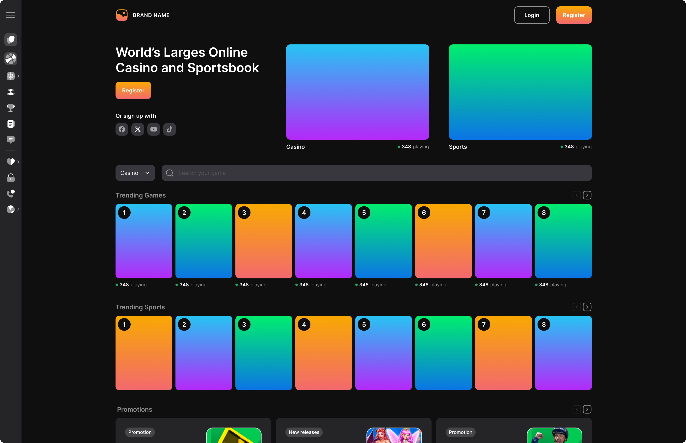
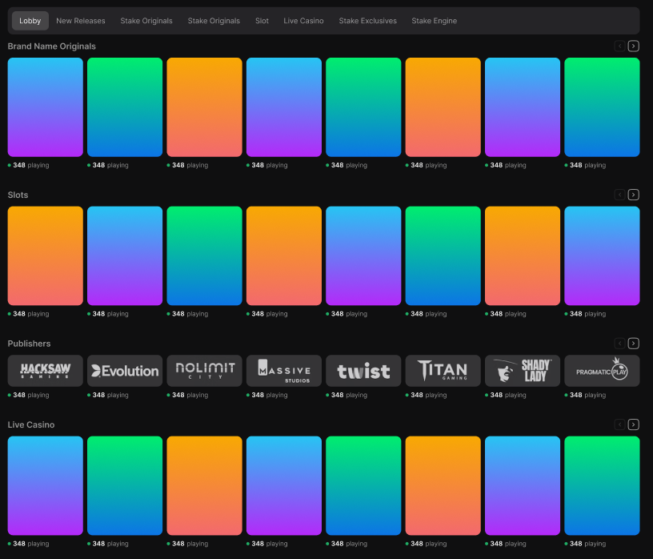
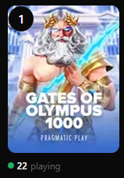

# Betida UI Kit - Casino & Sports Betting Components

Betida UI Kit is a modular, reusable component library for building modern casino and sports betting interfaces. It provides polished UI elements optimized for gaming experiences, including game cards, grids, and dynamic layouts. Built with performance in mind, it integrates seamlessly with Next.js applications.

Live Demo: [betida.dev](https://betida.dev)  
Preview: [test-cno.vercel.app](https://test-cno.vercel.app)

## Features

- **Reusable Components**: Pre-built UI elements like GameCard, GameGrid, and DynamicGameGrid for quick integration.
- **Image Optimization**: Cloudinary integration for low-quality image placeholders (LQIP) and efficient asset management.
- **Responsive & Animated**: Tailwind-powered responsive design with Framer Motion for smooth interactions.
- **Form Handling**: React Hook Form with Zod validation for user inputs like OTP and phone numbers.
- **State Management**: Lightweight Zustand for managing component state.
- **Dark Mode Support**: Next Themes for seamless theme switching.
- **Developer Tools**: Storybook for isolated component development and testing.

## Tech Stack

- **Frontend**: Next.js 15 (with Turbopack for fast dev/build), React 19 for dynamic UIs, and Typescript.
- **Styling**: Tailwind CSS 4 for utility-first, responsive design; clsx and tailwind-merge for conditional classes.
- **Components**: Radix UI primitives for accessible, unstyled foundations; Lucide React for icons.
- **Animations & UX**: Framer Motion for gestures and transitions; Embla Carousel for sliders.
- **Images & Assets**: Cloudinary and next-cloudinary for optimized uploads, LQIP, and transformations.
- **Forms & Validation**: React Hook Form with Zod resolver; input-otp and react-phone-number-input.
- **State & Utils**: Zustand for simple state; Lodash for utilities; date-fns and Day.js for dates.
- **Other**: Sonner for toasts; nextjs-toploader for progress bars; react-cookiebot for GDPR compliance.
- **Dev Tools**: TypeScript for type safety; ESLint with plugins (Next, React, Tailwind) for linting; Vitest for testing; Storybook 9 for component docs.

## Setup

1. **Clone the Repository**:
   ```
   git clone https://github.com/betida-dev/test-cno.git
   cd test-cno
   ```

2. **Install Dependencies**:
   ```
   npm install
   # or
   yarn install
   ```

3. **Set Up Environment Variables**:
   Copy `.env.example` to `.env.local` and fill in the required values (see [Environment Variables](#environment-variables) section below). Note: `.env.local` is already present but should be customized.

4. **Run the Development Server**:
   ```
   npm run dev
   # or
   yarn dev
   ```
   Open [http://localhost:3000](http://localhost:3000) to view the app in your browser.

5. **Build for Production**:
   ```
   npm run build
   # or
   yarn build
   ```
   Then start the production server:
   ```
   npm start
   # or
   yarn start
   ```

6. **Storybook (Optional)**:
   ```
   npm run storybook
   ```
   View at [http://localhost:6006](http://localhost:6006) for component exploration.

## Project Structure

```
test-cno
├── app/                          # Next.js app router
│   ├── api/                      # API routes
│   │   └── cloudinary/           # Cloudinary endpoints
│   │       ├── list/             # Route for listing assets
│   │       │   └── route.ts
│   │       └── lqip/             # Route for LQIP generation
│   │           └── route.ts
│   ├── components/               # UI components
│   │   └── ui/                   # Core UI primitives
│   │       ├── GameCard.tsx      # Individual game card component
│   │       ├── GameGrid.tsx      # Static game grid layout
│   │       └── DynamicGameGrid.tsx # Dynamic, responsive grid
│   ├── page.tsx                  # Root page
│   └── globals.css               # Global styles
├── config/                       # Configuration files
│   └── cloudinary.ts             # Cloudinary setup
├── lib/                          # Utility functions
│   └── useLQIP.ts                # Custom hook for LQIP
├── public/                       # Static assets
│   └── default.webp              # Default placeholder image
├── .env.local                    # Local environment variables
├── README.md                     # This file
├── tailwind.config.ts            # Tailwind configuration
├── postcss.config.js             # PostCSS setup
├── next.config.js                # Next.js configuration
└── package.json                  # Dependencies and scripts
```

## Deployment Instructions

This UI kit is designed for integration into larger Next.js apps and deploys easily on Vercel.

### Vercel Deployment

1. Push your code to a GitHub repository.
2. Connect your repository to Vercel via the dashboard.
3. Set environment variables in the Vercel project settings (see [Environment Variables](#environment-variables)).
4. Deploy automatically on push to the `main` branch, or trigger manually.
5. Custom Domain: Add `betida.dev` in Vercel domains for production.

For previews, branches trigger automatic preview deployments (e.g., `test-cno` branch → `test-cno.vercel.app`).

### Other Platforms

- **Netlify**: Connect Git repo and set build command to `npm run build`.
- **AWS Amplify**: Use Git-based deployment with Next.js runtime.

## Environment Variables

Create or update `.env.local` in the root and add the following. Never commit sensitive values to version control.

```
# Cloudinary
CLOUDINARY_CLOUD_NAME=your_cloud_name
CLOUDINARY_API_KEY=your_api_key
CLOUDINARY_API_SECRET=your_api_secret

# Next.js
NEXT_PUBLIC_CLOUDINARY_CLOUD_NAME=your_cloud_name  # For client-side

# Other (if integrating auth/payments)
NEXTAUTH_SECRET=your_nextauth_secret
STRIPE_SECRET_KEY=sk_test_...  # Optional for payments
```

Refer to Cloudinary docs for full setup.

## Screenshots / Preview URLs

  
*Suggested: Add a screenshot of the homepage to `public/screenshot-home.png`.*

  
*Suggested: Add a screenshot of the DynamicGameGrid in action to `public/screenshot-gamegrid.png`.*

  
*Suggested: Add a before/after LQIP example to `public/screenshot-lqip.png`.*

---

## Contributing

Contributions are welcome! Please fork the repo, create a feature branch, and submit a PR. Run `npm run lint` before committing. Use Storybook to test new components.

## License

This project is licensed under the MIT License - see the [LICENSE](LICENSE) file for details.

---

*Built with ❤️ for gaming UIs. Questions? Open an issue!*


## Contributions / Pull Requests
#### Updated on 29th september
- Migrated existing personal repo code to `betida-dev/test-cno` via import branch: `import/TrishonBaidaya7399-initial`
- Merged import branch into main through: `merge-imports-into-main`
- Opened PR: [1](https://github.com/betida-dev/test-cno/pull/1)
  
